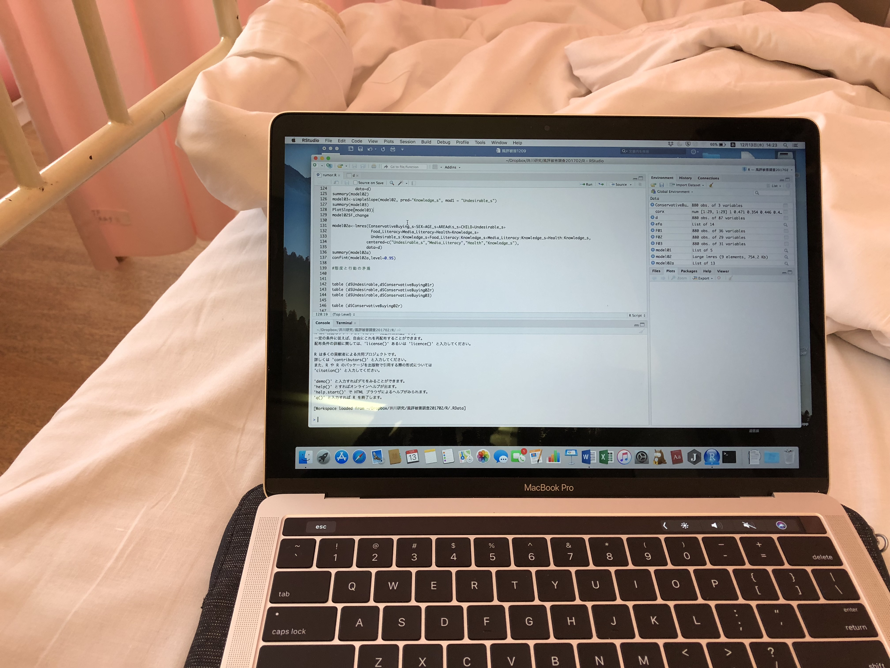
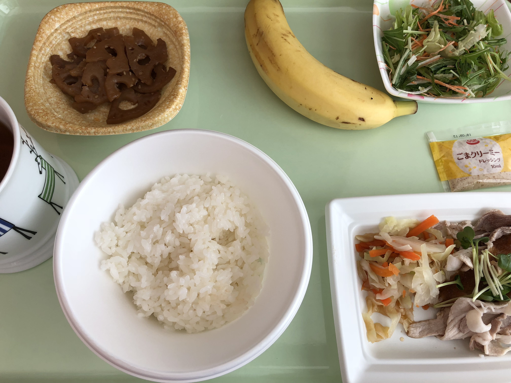

## 自己紹介 {#self01}

* 社会心理学者 (社会的影響、協力行動)
* 広島修道大学健康科学部心理学科 (修道院とは関係ありません)
* 経歴: 北教大函館 (学部) → (学歴ロンダ) → 北大 (博士前期・後期) → 広島修道大
* @daihiko


# Rとは {#whatisr01}

## Rの利点 {#whatisr02}

* フリーで (SPSSとかSASはバカ高い)
* 美しく (Excelのグラフは吐き気がする)
* CUI (GUIはクソ)

## Rを使うためにすること {#whatisr03}

* SPSSを物理的に棄てる。
    * 物理的に、永久に。
* Windowsを棄てる。
    * HADに頼ってしまうから。
    * しかし、JASPという強敵が……。


## Rを使っているとガンになっても大丈夫 {#whatisr04}

* 人文学部から健康科学部に配置転換になったらガンになりました。
* 何が健康だ。




## メラノーマ データセットを使って気を紛らわす {#whatisr05}

* MASSパッケージのMelanomaデータセット

```{r Melanoma, echo=FALSE}
head(MASS::Melanoma)
ulcer<-factor(MASS::Melanoma$ulcer)
plot(MASS::Melanoma$thickness,MASS::Melanoma$time, pch=21, cex=1, bg=c("red","green")[unclass(ulcer)])
cor.test(MASS::Melanoma$thickness,MASS::Melanoma$time)
t.test(MASS::Melanoma$time~MASS::Melanoma$ulcer)
```

## Rの基本 {#whatisr06}

* RはRStudioとセットで使うと便利なので、最初からRとRStudio両方インストールする。
* データはExcelで入力しても良いが、csv形式にする (csvが分からない人はググれください)。
    * データに日本語が入っている場合にはWindowsとMacとで対応が異なるが、you can write in English。

## Rで読み込むデータ {#whatisr07}

* ふつうのcsv形式のデータ
* いわゆるコンマで区切られたデータ
* 1オブザベーション1行のデータ (でなくてもいいけれど、とりあえず)
* 欠損値には「NA」を入れる。

## Rを使うときには {#whatisr08}

* Rをインストールする (当然)
    * cran.r-project.org
* RStudioをインストールする (これも当然)
    * www.rstudio.com


# RStudioの使い方 {#rstudio01}

## プロジェクトを作る {#rstudio02}

* プロジェクトを作る
    * なぜプロジェクトを作った方がよいかはまた後で自分で調べておいてください (ヒントはWorking Directory)。とにかく、プロジェクトを作る。

## Working Directoryの指定 {#rstudio03}

* 要するに「ここにデータがあって、ここで作業するよ」というフォルダ (= directory) のこと。
    * Session -> Set Working Directory -> Choose Directory
    * コンソールウィンドウに「setwd(“~/Dropbox/nakanisi/2017/SappoRoR")」とか表示されたら成功。

## ソースファイルの作成 {#rstudio04}

* ソースファイルとは、データのハンドリングや分析の命令を書くための手順書みたいなもの。
    * File -> New File -> R Script
        * とりあえず、名前を付けて保存しておく。
            * File -> Save As…
            * ここでは「test」という名前を付ける。
            
## データファイルの作成について {#rstudio05}

* データファイルはコンマ区切りのcsv形式
* 基本的に1オブザベーションにつき1行で入力 (そうじゃないほうがいい場合もあるがとりあえず)
* Excelで入力した場合には
    * ファイル -> 名前を付けて保存... -> フォーマットから「CSV (コンマ区切り) (.csv)」を選んで保存する。

# データをいじる {#data01}

## サンプルデータの構造 {#data02}

* data.csv
* 1行目は変数名 (英数字が無難)
* 欠損値はNA (本データにはない)
* 880人分の福島県産品についてのWeb調査データ
    
## どんなデータか (1) {#data03}

* ID……連番
* SEX……1が男、2が女
* AGE……年齢
* AREAdis……居住県の県庁所在地から福島市への距離
* MARRIED……1が未婚、2が既婚
* CHILD……1が子どもなし、2が子どもあり

## どんなデータか (2) {#data04}

* 以下6段階
    * Undesirable 福島第一原子力発電所の事故で起こった風評被害は望ましくない現象である
    * ConservativeBuying 国の基準が守られていれば、福島第一原子力発電所の近辺で採れた作物を食べることに抵抗はない

## どんなデータか (3) {#data05}

* 以下5段階
    * FoodLiteracy01 食品の安全性のことで知らないことがあると気になる
    * FoodLiteracy02 テレビの健康情報番組を見て、安易にまねしないようにしている
    * FoodLiteracy03 食品の安全性のための情報を日頃から積極的に集めている
    * FoodLiteracy04 同じ食品を毎日食べることはリスクがあるため、多くの種類の食品をバランスよく食べるようにしている
    * FoodLiteracy05 食品を買うときや食べるときは遺伝子組み換え食品であるかどうかを気にする
    * FoodLiteracy06 野菜や果物を買うときや食べるときは無農薬であるかどうかを気にする
    * FoodLiteracy07 加工食品を買うときや食べるときは食品添加物が入っているかを気にする
    * FoodLiteracy08 野菜や果物を買うときや食べるときは中国産であるかどうかを気にする
    * FoodLiteracy09 牛肉を買うときや食べるときはアメリカ産であるかどうかを気にする

## どんなデータか (4) {#data06}

Quiz01

* 人工放射線と自然放射線とで、どちらが人体への悪い影響を及ぼしますか。最も適切なものを1つ選んでください。
    * 人工放射線の方が悪影響を及ぼす
    * 自然放射線の方が悪影響を及ぼす
    * 自然か人工かで違いはない
    * どれも正しくない
    * 分からない

## どんなデータか (5) {#data07}

Quiz02

* 現在、原発事故による大気中や食品中の放射性物質が健康に及ぼす悪影響として何が一番おきやすいですか。最も適切なものを1つ選んでください。
    * 白血球が減少する
    * 鼻血が出る
    * 妊娠しにくくなる
    * これらのことは起こらない
    * 分からない

## どんなデータか (6) {#data08}

Quiz03

* 農産物の放射能のレベルが「ただちに健康に影響があるレベルではない」という発表はどのような意味ですか? 最も適切なものを1つ選んでください。
    * 将来的には影響がある
    * 将来的には影響があるかもしれない
    * 毎日一定量、長期間食べ続けないかぎり健康に影響するレベルに達しない
    * 毎日一定量、長期間食べ続けた場合の健康に影響するレベルはわかっていない
    * 分からない

## どんなデータか (7) {#data09}

Quiz04

* 人間が放射線を浴びたときの影響について「吸収線量に放射線の危険度に応じた値を掛けた」数値の単位をなんと言いますか。最も適切なものを1つ選んでください。
    * ベクレル
    * シーベルト
    * キュリー
    * グレイ
    * 分からない

## どんなデータか (8) {#data10}

Quiz05

* 1マイクロ・グラムは1ミリ・グラムの何分の1ですか？最も適切なものを1つ選んでください。
    * 10分の1
    * 100分の1
    * 1000分の1
    * 1万分の1
    * 分からない

## どんなデータか (9) {#data11}

Quiz06

* 原発事故によって、農産物に付着したり水道水に溶けたりした放射性物質の中で、乳幼児への健康被害が心配された、半減期が8日程度と比較的短いものは何ですか。
    * セシウム
    * ヨウ素
    * プルトニウム
    * ウラン
    * 分からない

# 分析編 {#analysis01}

## データの読み込み {#data12}

```{r}
d<-read.csv("data.csv", head=TRUE)
```

* data.csvをさきほど指定したWorking Directoryに移動またはコピーしよう。
* さきほど作成したソースファイルの一行目に上の文字列を入力する。
    * (data.csvの内容を読み込み、dというデータフレームに入れなさいという意味)
    * 「データフレームとは何か」など考えてはいけない (知りたいひとは、教えてぞうさん)。

## csvが嫌いな方 {#data13}

* SPSSとかExcelのファイルをそのまま読み込むこともできる。やり方はググれ。


## データをいじろう {#analysis02}

* まずはデータの全体像を知りたい。
* summary関数でdデータフレームの全ての変数の最小値、第1四分位、中央値、平均値、第3四分位、最大値が表示される。

```{r}
summary (d)
```

## 特定の変数の平均値だけ出す {#analysis03}

* 「d\$AGE」とは、「dというデータフレームのAGEという変数」という意味。
    * なんでそんな面倒くさいことをしなきゃいけないのかと思われるかもしれないが、複数のデータフレームを扱うこともあるのだから、しかたがない。大人になれば分かる。

```{r}
mean(d$AGE)
```


## 男女別に年齢の平均値を出す (汎用的な方法) {#analysis04}

* na.rm=TRUE……欠損値は無視しろという命令。
* function(data)……おまじない。気にしない。
* meanをsdにすれば標準偏差が出る

```{r}
by (d, d$SEX, function(d) mean(d$AGE, na.rm=TRUE))
```

## 男女別に年齢の平均値を出す (簡単な方法: 複数の値を返す関数には使えない) {#analysis05}

```{r}
tapply(d$AGE, d$SEX, mean, na.rm=TRUE)
```

## データの構造 {#analysis06}

* データ (変数) にはいろいろな種類がある。よく使うのは、
    * numeric: 数値
    * integer: 整数型
    * factor: 因子型 (カテゴリカルな変数)

## データ構造を確認する {#analysis07}

```{r}
str(d)
```
* ほとんどint型になる。小数はnum型。
* でも、SEXとかCHILDはfactor型が正しい (なんで正しい型じゃなければいけないのかと思うかもしれませんが、分散分析のときにfactor型じゃないものを独立変数にするとうまく動かないとかそういうことがあるので、とにかく問答無用でやっておく)。

## 変数一覧を出力 {#analysis08}

```{r, eval}
names(d)
```

## データの型の変換 {#analysis09}

* factor関数でカテゴリカル変数に
    * sex=1が男性、sex=2が女性。でも分かりにくい。どっちがどっちだったか分からなくなるかもしれない (ふつうはコード表作成するから忘れたりしない)。忘れる前に、以下のコードを実行しよう。
    * <- は右辺を左辺に代入するという意味
* 終わったら、「str(d)」で、かくにん!

```{r}
d$ID<-factor(d$ID)
d$SEX<-factor(d$SEX, labels=list("male", "female"))
d$MARRIED<-factor(d$MARRIED,labels=c("dontmarried","married"))
```

```{r}
tapply(d$AGE, d$SEX, mean, na.rm=TRUE)
tapply(d$AGE, d$SEX, sd, na.rm=TRUE)
```

## 変数の加工 {#analysis10}

* 複数の変数の合計

```{r, results='hide'}
d$FoodLiteracy_all<-d$FoodLiteracy01+d$FoodLiteracy02+d$FoodLiteracy03+d$FoodLiteracy04
+d$FoodLiteracy05+d$FoodLiteracy06+d$FoodLiteracy07+d$FoodLiteracy08+d$FoodLiteracy09
```

```{r}
hist(d$FoodLiteracy_all)
```

## 条件処理 {#analysis11}

```{r}
d$Quiz01A<-ifelse(d$Quiz01==3,1,0)
d$Quiz02A<-ifelse(d$Quiz02==4,1,0)
d$Quiz03A<-ifelse(d$Quiz03==3,1,0)
d$Quiz04A<-ifelse(d$Quiz04==1,1,0)
d$Quiz05A<-ifelse(d$Quiz05==3,1,0)
d$Quiz06A<-ifelse(d$Quiz06==2,1,0)
d$Quiz<-d$Quiz01A+d$Quiz02A+d$Quiz03A+d$Quiz04A+d$Quiz05A+d$Quiz06A
hist(d$Quiz)
```

## 散布図 (1) {#analysis12}

```{r}
plot(d$Quiz,d$FoodLiteracy_all)
```

## 散布図 (2) {#analysis13}
* ggplot2パッケージを使う (インターネット接続必要)。
    * Tools -> Install Packages…
    * Packagesの欄にggplot2と入力しinstall

```{r}
library("ggplot2")
ggplot(d,aes(x=Quiz, y=FoodLiteracy_all, colour=SEX)) + geom_jitter(size=2)
```

## 相関係数 {#analysis14}

```{r}
cor.test(d$Quiz,d$FoodLiteracy_all)
cor.test(d$Quiz,d$FoodLiteracy_all,method="spearman")
```

## 総当たりの相関を求めたい {#analysis15}

* psychパッケージのcorr.test関数を使う (インターネット接続必要)。
    * Tools -> Install Packages…
    * Packagesの欄にpsychと入力しinstall

```{r message=FALSE}
library(psych)
corrvar<-data.frame(d$AGE,d$AREAdis,d$ConservatibeBuying,d$Undesirable,d$FoodLiteracy_all,d$Quiz)
corr.test(corrvar)
```

## 複数の相関係数を眺める {#analysis16}

```{r message=FALSE}
library(corrplot)
corplot1<-cor(corrvar)
corrplot(corplot1)
```

## t検定 {#analysis17}

* Rの不親切なt.test関数で消耗してみる (1)

```{r}
t.test(d$Quiz~d$SEX)
tapply(d$Quiz, d$SEX, sd, na.rm=TRUE)
table(d$SEX)
```

## t検定 {#analysis18}

* Rの不親切なt.test関数で消耗してみる (2)

```{r}
library(compute.es)
result_t<-t.test(d$Quiz~d$SEX)
result_sd<-tapply(d$Quiz, d$SEX, sd, na.rm=TRUE)
result_table<-table(d$SEX)
mes(result_t$estimate[1],result_t$estimate[2],result_sd[1],result_sd[2],result_table[1],result_table[2])
```

#関数の作成

## 便利な (でも不完全な) t検定の関数を作る {#function01}

* t.test関数が不親切だって? だったら関数作ればいいべや。

```{r}
daihiko_t<-function(x,y,paired=TRUE) {
  if (paired) {
    d<-data.frame(x,y)
    d<-subset(d,complete.cases(d))
    rt<-t.test(d$x,d$y,paired=TRUE)
    rsd<-c(sd(d$x,na.rm=T),sd(d$y,na.rm=T))
    cohend<-abs(mean(d$x-d$y)/(sd(d$x-d$y)/sqrt(2*(1-cor(d$x,d$y)))))
    return(list(meanx=mean(d$x),meany=mean(d$y),SD=rsd,t=rt,cohend=cohend))
  }
  else {  
    rt<-t.test(x~y)
    rsd<-tapply(x,y,sd,na.rm=TRUE)
    rt1<-table(y,x)
    rt2<-apply(rt1,1,sum)
    cohend<-(rt$estimate[1]-rt$estimate[2])/sqrt(((rt2[1]-1)*rsd[1]^2+(rt2[2]-1)*rsd[2]^2)/(rt2[1]+rt2[2]-2))
    cohend<-unname(cohend)
    return(list(N=rt2,SD=rsd,t=rt,cohend=cohend))
  } 
}
```

## 便利な (でも不完全な) t検定の関数を使う (1) {#function02}

```{r}
daihiko_t(d$Quiz,d$SEX,paired=FALSE)
```

## 便利な (でも不完全な) t検定の関数を使う (2) {#function03}

```{r}
daihiko_t(d$FoodLiteracy01,d$FoodLiteracy02,paired=TRUE)
```
